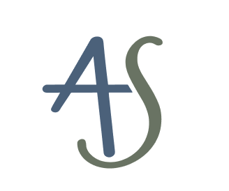

<table>
<tr>
<td width="100" valign="middle">

</td>
<td valign="middle">
<h1>Hi, I'm Aaditya Singh 👋</h1>

<strong>Engineer ⦁ Community Builder ⦁ Infrastructure Architect</strong>

</td>
</tr>
</table>

## About Me:

> *"Engineering systems that don't just scale, they sustain"*

I'm an Electronics & Communication Engineering graduate from Jharkhand, India 🇮🇳. Growing up in a land shaped by steel, mining, and forests taught me that the best systems aren't the flashiest. They're the ones that remain reliable and maintainable over years. I didn't have access to technology until I got enrolled in university, which meant instead of consuming it passively, I approached it with eagerness to dissect how things work across different circumstances.So, designing distributed systems, resilient architectures, and accessible technology became my focus building platforms that perform under real world pressure while strengthening ecosystems through documentation and collaboration.

### What I Do
<i>

- Full Stack Development
- Software Development
- Data Engineering & Analytics
- Data Science (Machine Learning & Artificial Intelligence)

</i>

### Tools & Technologies

 

<!-- Analytics -->

<!-- Database -->

<!-- DevOps and Infra -->

<!-- Languages -->

### Statistics

<table style="border: none;">
  <tr style="border: none;">
    <td style="border: none;">
      
    </td>
    <td style="border: none;">
      
    </td>
  </tr>
  <tr style="border: none;">
    <td style="border: none;">
      
    </td>
    <td style="border: none;">
      
    </td>
  </tr>
</table>

<!-- Fix(Blogs and Articles) Required to be Published -->
<!-- ### Articles

- [Blog1]()
- [Blog2]()
- [Blog3]()

### Case Studies

 -->

<!-- ### Recoginiton  -->

## Forums

Platforms where I practice problem solving, experiment with ideas, and engage with the developer community.

<!--  -->

## Connect

Stay connected and join the spaces where I share updates, discuss ideas, and collaborate with the community

---

###  Thanks for Visiting!

Got questions, comments, or feedback? 
Feel free to reach out and contact me.

 

Licensed under MIT · Aaditya Singh · All Rights Reserved

<picture>
  <source media="(prefers-color-scheme: dark)" srcset="https://capsule-render.vercel.app/api?type=waving&color=588157&height=100&section=footer">
  <source media="(prefers-color-scheme: light)" srcset="https://capsule-render.vercel.app/api?type=waving&color=588157&height=100&section=footer">
  
</picture>