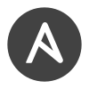

# 👋 Hi, I’m Aaditya Singh

<h3>Software Developer | Open Source Contributor | System Optimiser</h3>

### 🌍 Vision
> Bridging technology and communities by designing resilient, scalable systems that empower individuals and improve digital accessibility.

### 🚀 Mission
I strive to build engineering ecosystems that go beyond just scalable code — focusing on **real-world impact**, **developer empowerment**, and **sustainable tech**. Whether it's through open-source contributions, system design, or mentorship, I aim to create tools and platforms that *actually work under pressure*.

### 👨‍💻 About Me

- 🎓 ECE Graduate from Jharkhand, India
- 🔧 Transitioned from hardware systems to backend infrastructure to solve system fragility at scale
- 🌐 Contributor to global open-source orgs like **FOSSology** & **FOSSASIA**
- 💬 Advocate for accessible systems in healthcare, education, and industrial automation

### 🛤️ My Journey

| Role | Organization | Highlights |
|------|--------------|------------|
| 🏗️ GSoC 2024 Contributor | FOSSology | Rebuilt legacy C scheduler into a modern Go backend. Improved concurrency, task orchestration, and system stability. |
| 🔧 Codeheat Contributor | FOSSASIA | Engineered badge generation & event workflows. Integrated real-time email & UI logic for seamless user experience. |
| ⚙️ Graduate Engineer Trainee | Jindal Steel | Deployed high-voltage systems and optimized HMI networks for real-time plant operations. |
| 🗃️  Vocational Trainee | MECON Ltd. | Built an asset tracking system that improved record efficiency by 20%, maintaining over 1,000 records under a 1GB DB limit. |
| 🔐 Web Development Trainee | Walkover | Designed a credential management system with Firebase & Node.js; proposed cloud-native auth system reducing error rates. |

### 🌱 Community + Mentorship

> "Implementing Extreme Ownership requires checking your ego and operating with a high degree of humility."

    
- 👥 Mentored 100+ first-time contributors.
- 📣 Shared lessons on OSS navigation, Git workflows, and project onboarding
- 💡 Helped transform curiosity into confidence across multiple learning communities

### 💡 What Drives Me?

Building systems that *simplify*, *scale*, and *serve*—especially under real-world stress. Whether it's fault-tolerant backends, cross-functional toolchains, or developer onboarding, I'm driven by design that *delivers*.

> "I’m not just building code — I’m building ecosystems that work better for everyone."

### 🧰 Tools & Technologies

<!-- Analytics -->

<!-- Databases -->

 

<!-- Languages -->

 

<!-- DevOps & Infra -->

 

### 🖋️ Development Forums

<!--  -->

### 📡 Communication Channels

### ☕ Sponsor

<!--  -->

